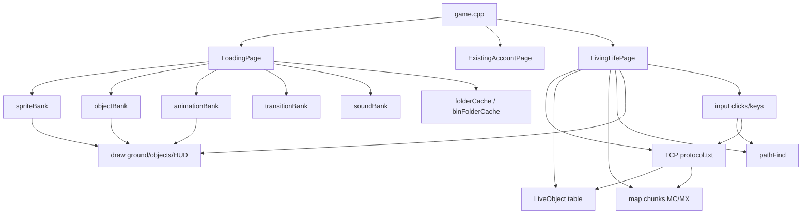
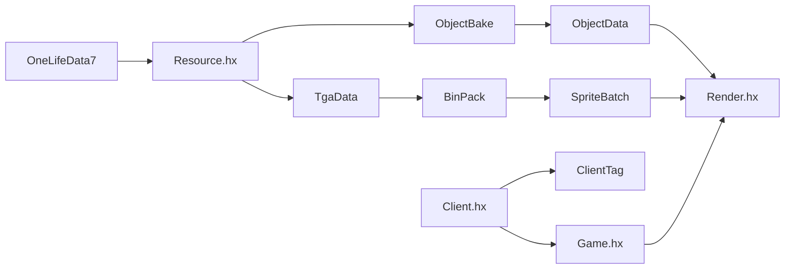
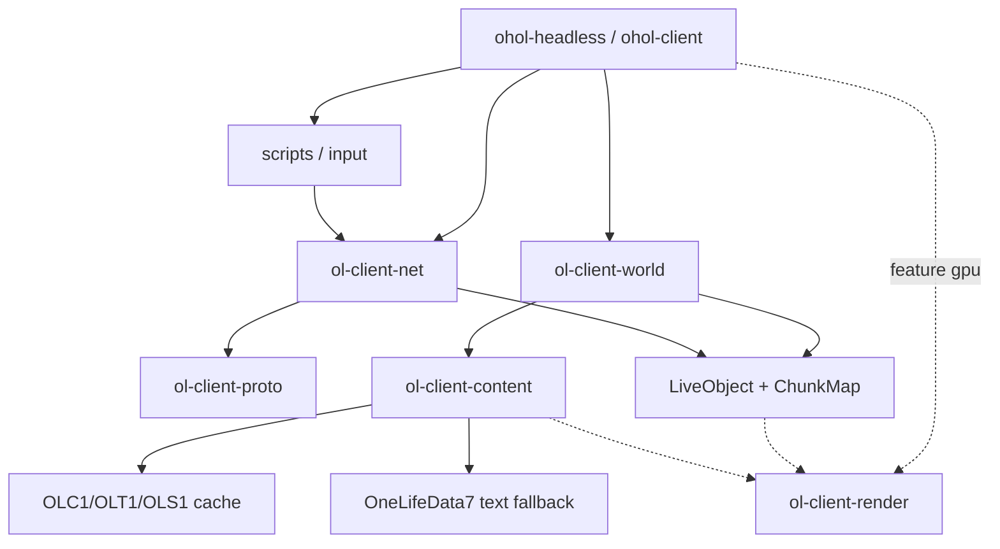
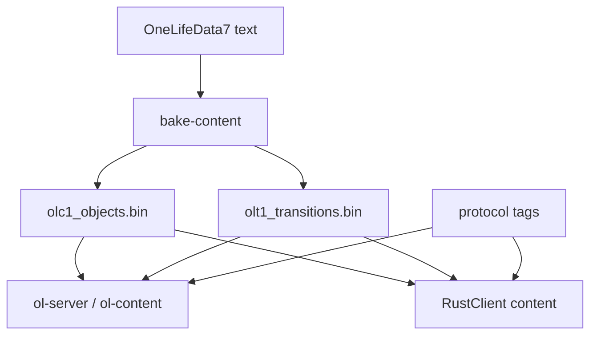
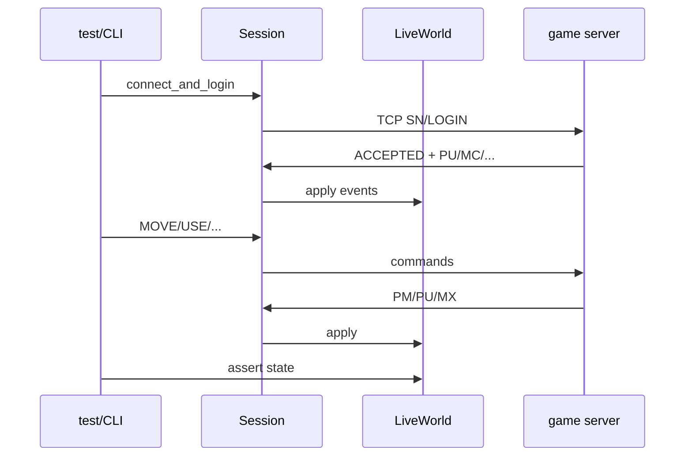
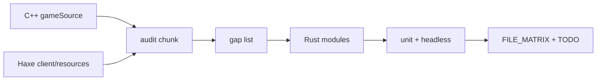

# Client dependency graphs

**Narrative overview:** [README.md](README.md) · **modules:** [ARCHITECTURE_RUST_CLIENT.md](ARCHITECTURE_RUST_CLIENT.md)  
Mermaid only — no status tables here.

---

## 1. C++ client runtime

---

## 2. Haxe client (assets focus)

---

## 3. Target Rust client

---

## 4. Shared with Rust server

---

## 5. Headless test flow

---

## 6. Port data flow (chunk work)

