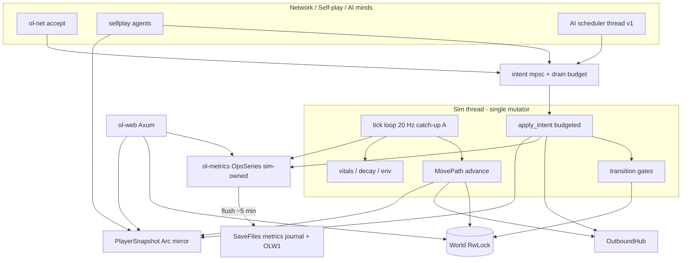
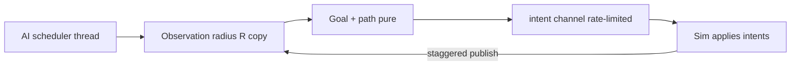

# Next Steps: Movement Timings, Web Metrics UI, Exact Birth & AI NPCs

| Field | Value |
|-------|--------|
| **Document** | Open Life Reborn — Next Steps Design |
| **Author** | _(team)_ |
| **Date** | 2026-07-22 |
| **Status** | Draft (rev 4 — user decisions: path replace, Haxe-identical PM, npc_min=3) |
| **Canonical scratch** | `C:\Users\marti\AppData\Local\Temp\grok-marti\grok-design-doc-d8d69ed4.md` |
| **Repo copy** | `docs/design/NEXT_STEPS_MOVEMENT_WEB_AI.md` |
| **Related** | `docs/architecture/RUST_SERVER_REBUILD_PLAN.md`, `docs/PROGRESS.md`, `docs/BUILD_BACKLOG.md` |

---

## Overview

The Rust Open Life Reborn server (`C:\OhOl\OpenLifeReborn`) already runs a multi-threaded sim loop, shared `RwLock` world, MOVE/USE/DROP core path, reverse craft graph, thin profession self-play, OLW1/OLN1/OLA1 persistence, and an embedded Axum web surface. Full Haxe parity is **not** claimed.

This design prioritizes **Haxe parity for movement timings, PM wire, and object-transition gating** first. Self-play “unstick walk” has **two co-equal causes**: (1) missing server timed movement / action sequencing, and (2) self-play agent heuristics (`stuck_use_count` / `same_spam`) that fire even on healthy multi-use forage. Fixing only the sim will not zero unstick logs without agent changes.

It then plans web UI migration with RAM-first ops metrics (including catch-up “skip” ticks and lock wait), exact birthing fitness logic, and a basic AI runtime (v1 = single scheduler thread, later adaptive workers). PHOTO and VOG stay postponed; new non-Haxe features are only lightly suggested.

---

## Background & Motivation

### Current state (Rust)

| Area | Implementation | Gap vs Haxe |
|------|----------------|-------------|
| Tick loop | `run_sim_loop_with_views` at `tick_hz=20`, `tokio::time::interval` + `MissedTickBehavior::Skip` (`crates/ol-sim/src/lib.rs` ~7918) | `skip_ticks` never incremented; tokio **Skip drops wakes** (no work). Haxe does **not** drop work — it advances an extra tick index and runs **one** `DoTimeStuff` with larger `timePassedInSeconds` (time compression). See §1.6. |
| MOVE | `apply_move_deltas` **sums** deltas, writes final `x,y` only (no per-step walkability), biome check on **final** tile only, teleports held baby; emits PU + FM. `ol-protocol` parses `MOVE … @seq` but **`NetIntent::Move` drops `seq`** (`ol-net` ~318–323) | No timed path, exact float, PM, or per-tile advance; `done_moving_seq` is server autoincrement, not client `@seq`; baby already teleports with carrier (must sync per commit under timed move) |
| KeepAlive | `NetIntent::KeepAlive` → `set_player_position` **unconditionally** sets `p.x/p.y` (~6894–6908, ~8062) | Self-play sends KA to optimistic destination after every MOVE (~571–577) — will fight `MovePath` unless gated |
| Move speed | `WALK_MOVE_SPEED = 3.75` tiles/s; notes in `move_notes.rs` | Reported on PU only; does not gate tile advance |
| USE | `apply_use_at`; Chebyshev `dist > 2`; fail → `send_player_update_and_frame` | No moving gate; distance metric is not Haxe (Haxe = squared Euclidean) |
| DROP/REMV | `apply_drop` has **no distance check** and no moving check | Haxe DROP uses same `checkIfNotMovingAndCloseEnough` |
| Self-play | ~400 ms loop; unstick when `same_spam` **or** `stuck_use_count >= 3` (every successful USE send increments counter) | Agent logic independently sticky on multi-use; also optimistic MOVE+KA |
| `PlayerSnapshot` | `conn_id, p_id, x, y, held_id, food, food_max, age, email, deleted` only | No `moving` / `done_moving_seq` — self-play cannot observe path-busy |
| Metrics | `Counters` atomics include dead `skip_ticks`; `EmaLatency` / `ScopeTimer` exist but unused for ops series | No RAM ring / flush / graphs |
| Web | `/viewer`, `/health`, `/api/*` | No `/ops` |
| Birth | `fertility.rs` age 14–**55**, cooldown 120 s, gestation 30 s; `spawn_child` / SAY BIRTH | Haxe `isFertile` uses **14–42** (`MinAgeFertile`/`MaxAgeFertile`); Rust `age_curves::FERTILE_MAX = 42` — **inconsistent**; no mother/father fitness |
| AI | Thin goals + self-play | Not `AiBase`; no NPC scheduler |

### Haxe reference (what “right” means)

**Time loop** — `TimeHelper.DoTimeLoop`:

- `tickTime = 1/20`. When wall ahead of tick-time **and** `tick % 10 != 0`: `tick += 1` extra, `skipedTicks++`, then **one** `DoTimeStuff()` where `timePassedInSeconds = (tick - lastTick) * tickTime` (often **2×** tickTime). Sleep when tick-time ahead of wall.
- **`skipedTicks` means catch-up advances (compressed sim dt), not “ticks we refused to run.”**

**Movement** — `MoveHelper`:

- Path accept freezes `moveSpeed`; `totalMoveTime = length / speed`; `startingMoveTicks`; `newMoves`.
- Per tick: `timePassed = CalculateTimeSinceTicksInSec(timeExactPositionChangedLast)`; advance exact; commit tile when `moved >= step length`; residual stays on next step; `SetHeldPlayerPositionToSame` on commit.
- PM: `p_id targetX targetY total_sec eta trunc dx0 dy0 …` (totals rounded to 2 decimals); nearby via `SendMoveUpdateToAllClosePlayers`.
- `isMoveing()` ⇔ `newMoves != null`. Cancel → VOG + chunk + forced PU + FRAME (Rust subset: force PU+FM; playtest without VOG).

**Transitions** — `checkIfNotMovingAndCloseEnough`:

- Reject if moving.
- `player.isClose(x,y,useDistance)` = **squared Euclidean** `dx²+dy² <= d²` (`GlobalPlayerInstance.hx` ~1780–1786). Default `useDistance = max(held.useDistance, 1)`. With d=1, **diagonal USE fails** (2 ≰ 1).

**AI** — single `AiBase.RunAi` thread for all AIs; adaptive `currentMaxAIs` 20–40; `waitingTime` / `movedOneTile`.

**Birth** — fitness + `EveOrAdamBirthChance = 0.025`; `isFertile` ages **14–42**.

**Web** — landing + `/stats/players|lineage|food|accounts`.

### Pain: self-play “unstick walk” (two causes)

In `selfplay.rs` ~616–691:

1. **Agent heuristics (independent of sim health):** every USE send increments `stuck_use_count`; at `>= 3` **or** `same_spam` (same tile within 6 agent ticks) → random MOVE + log `unstick walk`. Multi-use forage **will** unstick on the 3rd USE even if transitions succeed.
2. **Server sequencing gap:** instant MOVE; no USE-while-moving gate; self-play always walks every loop and KA-teleports to optimistic coords.

**Both** must be fixed for acceptance. Timed movement alone is **not** sufficient.

Secondary:

- No post-USE wait (`waitingTime` analog).
- Multi-use LASTUSE without waiting for world mirror.
- KA mid-path will desync timed paths (Issue 3).

---

## Goals & Non-Goals

### Goals

1. **Movement timings** match Haxe at 20 Hz: timed multi-tile paths, exact position, PM on accept, tile commits over ticks.
2. **Position authority:** server tile + `MovePath` own truth; KA cannot jump mid-path.
3. **Object transitions** reject while moving; **squared-Euclidean** distance (Haxe); DROP/REMV same gates; always unstick on fail.
4. **Tick lag policy (option A):** Haxe catch-up accounting — larger dt when behind; `skip_ticks` = catch-up advances, **not** dropped work.
5. **Web UI** feature-similar to Haxe stats, better IA; ops graphs; ~5 min disk flush of RAM series.
6. **Exact birthing** fitness/Eve; resolve fertile age 42 vs 55 before wire.
7. **Basic AI NPCs:** intent-only minds; **v1 single scheduler thread** (Haxe-like); adaptive population; dual-clock metrics.
8. **Parity-first**; self-play harness with machine-checkable acceptance.

### Non-Goals

- PHOTO backend, VOG god-mode mutations (stubs remain; cancel playtests force PU+FM without VOG).
- Full `AiBase` port in one go.
- Nested OLW1 container persistence (backlog).
- SQL / external DB for metrics.
- Non-Haxe gameplay expansion (light suggestions only).
- Native client rewrite.

---

## Key Decisions

| # | Decision | Rationale |
|---|----------|-----------|
| K1 | **`MovePath` state machine on `Player`** (Haxe `MoveHelper` subset) before AI depth | Protocol clients need timed move; necessary but **not sufficient** for unstick zero |
| K2 | **Gate USE/DROP/REMV on `!is_moving()`** + squared-Euclidean range | Haxe `checkIfNotMovingAndCloseEnough` |
| K3 | **Sim single-threaded mutation; path advance only on tick phase** | Mirrors Haxe `updateMovement` in `DoTimeStuffForPlayer` |
| K4 | **`skip_ticks` = Haxe catch-up advances only (option A)** — not tokio dropped wakes | Avoid conflating Skip with Haxe; see §1.6 |
| K5 | **Ops metrics: RAM ring, flush ~5 min** under `SaveFiles/` | User accuracy + journal pattern |
| K6 | **AI minds never write world**; only `NetIntent` | Body/mind split |
| K7 | **Adaptive AI *population***; **v1 = one scheduler thread** (Haxe `RunAi`); multi-worker later | Avoid premature pool complexity |
| K8 | **Postpone PHOTO/VOG**; order: movement+PM → transitions → self-play green → (web ops ∥ birth pure) → birth wire → AI | Reconciles calendar with critical path |
| K9 | **Self-play harness** requires **sim + agent** fixes; reason-tagged unstick counters | Two-cause model |
| K10 | **PM on path accept is required with timed tiles** — ship together; `timed_movement` **default off** until Haxe-behavior PM playtest (K14) | Avoid worse desync than instant MOVE |
| K11 | **Position authority: ignore KA abs coords while `move_path.is_some()`** (or accept only if within jump budget of exact) | Prevents self-play/client KA teleport |
| K12 | **Extend `PlayerSnapshot` with `moving` + `done_moving_seq`** in same PR as MovePath | PR5 cannot observe path-busy otherwise |
| K13 | **New MOVE while mid-path: replace path** — cancel residual tiles and install a new `MovePath` (Haxe-like) | User decision (final); do not queue paths |
| K14 | **PM + movement timing: client-observed behavior must match Haxe `MoveHelper`** — relative/wrap/`gx`/`gy` as Haxe emits; optimizations only if behavior-identical; capture live Haxe PM samples in PR2 if needed | User decision: “make it work like in haxe code”; no simplified absolute-only free pass |
| K15 | **When `npc_enabled`, default population min = 3** (Forager/Farmer/Hunter-style), not 0 | User decision; still gated by `npc_enabled` |

---

## Implementation contract (before PR2)

Required types/signatures implementers must land (unit-tested):

```rust
// crates/ol-sim/src/move_path.rs (new) + player.rs
pub struct MovePath {
    pub start_x: i32,
    pub start_y: i32,
    pub remaining: Vec<(i32, i32)>,
    pub speed: f32,                 // frozen at accept
    pub length: f32,
    pub total_sec: f32,
    pub start_tick: u64,            // Haxe startingMoveTicks
    pub step_anchor_tick: u64,      // Haxe timeExactPositionChangedLast
    pub step_progress: f32,         // distance already covered along current step [0, step_len)
    pub exact_x: f32,
    pub exact_y: f32,
    pub seq: i32,                   // client @seq (Haxe newMoveSeqNumber); set done_moving_seq on complete/cancel
    /// PM trunc flag:
    /// - **1** if walkability/biome-block dropped any client delta (path shortened).
    /// - **0** when full client path accepted.
    /// Phase-1 **biome-speed** mid-path cut (Haxe floor/biome speed change) is **deferred** — never set trunc solely for that until later.
    pub trunc: i32,
}

pub fn is_moving(p: &Player) -> bool { p.move_path.is_some() }

/// Resolve path seq: prefer client `@seq`; if None (self-play / missing), server counter.
pub fn resolve_move_seq(player: &Player, client_seq: Option<i32>) -> i32 {
    client_seq.filter(|&s| s > 0).unwrap_or_else(|| {
        player.done_moving_seq.saturating_add(1).max(1)
    })
}

pub fn apply_move_path_start(
    state: &mut SimState,
    outbound: &OutboundHub,
    conn_id: u64,
    xs: i32,
    ys: i32,
    deltas: &[(i32, i32)],
    client_seq: Option<i32>,
) -> Result<(), MoveReject>;

pub fn tick_move_paths(state: &mut SimState, dt: f32, outbound: &OutboundHub);
pub fn cancel_movement(state: &mut SimState, outbound: &OutboundHub, conn_id: u64, seq: i32, use_vog: bool);

/// Squared-Euclidean range (Haxe isClose).
pub fn in_use_range(px: i32, py: i32, tx: i32, ty: i32, use_distance: i32) -> bool {
    let dx = (px - tx) as i64;
    let dy = (py - ty) as i64;
    dx * dx + dy * dy <= (use_distance as i64) * (use_distance as i64)
}

// PlayerSnapshot — extend publish path
pub struct PlayerSnapshot {
    // ...existing fields...
    pub moving: bool,
    pub done_moving_seq: i32,
}

// KeepAlive
// while is_moving(p): do not apply KA x,y to tile (log debug); still touch AFK if desired
pub fn set_player_position_respecting_path(...);

// --- ol-net plumbing (REQUIRED in PR2; today seq is dropped) ---
// crates/ol-protocol already parses: MOVE xs ys @seq dx dy ... → ClientCommand::Move { seq: Option<i32>, ... }
// crates/ol-net/src/lib.rs currently:
//   ClientCommand::Move { xs, ys, deltas, .. } => NetIntent::Move { conn_id, xs, ys, deltas }  // discards seq
// Must become:
pub enum NetIntent {
    // ...
    Move {
        conn_id: u64,
        xs: i32,
        ys: i32,
        deltas: Vec<(i32, i32)>,
        /// Client `@seq` from wire; None if omitted (self-play, old clients).
        seq: Option<i32>,
    },
    // ...
}
// Map: ClientCommand::Move { xs, ys, deltas, seq } => NetIntent::Move { conn_id, xs, ys, deltas, seq }
// apply_intent: apply_move_path_start(..., intent.seq); on complete/cancel done_moving_seq = path.seq
// Self-play / AI: NetIntent::Move { seq: None, ... } → resolve_move_seq uses server counter
// Unit test: client "@5" → path complete PU done_moving_seq == 5

// ol-protocol PM out
pub fn format_player_moves_start(
    p_id: i32,
    xs: i32,
    ys: i32,
    total_sec: f32,
    eta_sec: f32,
    trunc: i32,
    deltas: &[(i32, i32)],
) -> String;
// Golden (1-step east @ 3.75 t/s, total=eta=0.27 rounded): see §1.2 PM wire
```

---

## Proposed Design

### Architecture (target)



### Priority 1 — Movement timings & object transitions

#### 1.1 Data model: `MovePath` on `Player`

See **Implementation contract** for full struct. Critical Haxe fields not optional:

| Field | Haxe analog | Role |
|-------|-------------|------|
| `step_anchor_tick` | `timeExactPositionChangedLast` | Debug / optional Haxe-parity; **advance uses incremental `dt` only** (see §1.3) |
| `step_progress` | distance along current step | In `[0, step_len)`; **not** leftover time budget |
| `start_tick` | `startingMoveTicks` | ETA = `total_sec - (tick-start)*tickTime` for PM recompute |
| `speed` | `moveHelper.moveSpeed` | Frozen at accept |
| `seq` | `newMoveSeqNumber` | From client `@seq` via `NetIntent::Move.seq`; else server counter |
| `trunc` | path truncated for wire | **1** if walkability dropped deltas; biome-speed cut deferred |

`Player`:

- `move_path: Option<MovePath>` — `Some` ⇔ moving.
- `moving: bool` kept in sync for snapshot (`moving = move_path.is_some()`).
- `done_moving_seq` **= path.seq** on complete/cancel (not an independent autoincrement when client sent `@seq`).

Constants:

| Constant | Value | Source |
|----------|-------|--------|
| `WALK_MOVE_SPEED` | 3.75 | `ol-sim` / Haxe `InitialPlayerMoveSpeed` |
| `tickTime` | `1/tick_hz` | config |
| Min move age | later | Haxe `MinMovementAgeInSec = 14` (age×60) |

#### 1.2 MOVE accept path (replace instant teleport)

**Today:** sum deltas → set end tile → PU (final biome only; no `blocks_walking`).

**Target:**

1. Validate not deleted / sleeping / sitting.
2. Start snap: if Chebyshev(`xs,ys`, server tile) > `move_jump_max_chebyshev` (default 2), reject or cancel (phase-1 soft; jump/exhaustion later).
3. **Per-step walkability truncate** (not biome-speed truncate):
   - Walk client `deltas` in order; keep steps while `is_walkable` + `!biome_blocks_move` on each intermediate tile.
   - Stop at first blocked step (do not include that step).
   - Let `accepted = kept deltas`. If `accepted` is empty → reject path.
   - **`trunc = 1`** if `accepted.len() < deltas.len()` (any client delta dropped for walkability/impassable biome).
   - **`trunc = 0`** if full client path accepted.
   - **PM wire lists only `accepted` deltas** (never the discarded tail — client must not animate dropped steps).
   - Phase-1 does **not** implement Haxe biome-*speed* mid-path cut (road/floor speed change). That deferred feature also uses `trunc`; until then walkability is the only reason for `trunc=1`.
4. Length over **accepted** only: cardinal 1.0, diagonal √2 (Haxe `calculateLength`).
5. `speed = player_move_speed(...)` frozen; `seq = resolve_move_seq(player, client_seq)`.
6. Install `MovePath` with `remaining = accepted`, `step_anchor_tick = now`, `step_progress = 0`, exact = current tile center; **do not** set tile to path end.
7. Emit **PM** to nearby (see PM wire below) + actor — body uses accepted deltas + `trunc` from step 3.
8. Optional PU without force=1; `moving=true`.
9. Success.

**Golden (walkability trunc):** client `MOVE 10 20 @4 1 0 1 0` but second east tile blocked → PM `… trunc=1` with **one** delta `1 0` only; path.seq = 4.

**Held baby:** on each **tile commit**, set baby `x,y` to carrier (Haxe `SetHeldPlayerPositionToSame`) — today only on instant end teleport.

##### PM wire format (implementer-ready) — **Haxe-behavior-identical (K14)**

**Requirement (user final):** client-observed PM and movement timing must **behave like Haxe**. Prefer matching `MoveHelper` emission (`generateRelativeMoveUpdateString`, `SendMoveUpdateToAllClosePlayers`) over inventing a simplified absolute-only protocol. Optimizations allowed **only if behavior-identical**. Capture **live Haxe PM samples during PR2** if needed to lock wire details (observer relative coords, wrap, `gx`/`gy`).

Haxe body shape (`MoveHelper.generateRelativeMoveUpdateString` ~727–735):

```
${p_id} ${targetX} ${targetY} ${totalMoveTime} ${eta} ${trunc} ${dx0} ${dy0} ... ${dxN} ${dyN}
```

- `totalMoveTime` / `eta`: rounded to **2 decimals** (`Math.round(x*100)/100`).
- **Coordinates:** use the same frame Haxe uses for each recipient — including `transformX`/`transformY` relative to observer `gx`/`gy` when the world/player model has those fields. Do **not** treat “absolute for everyone” as correct if Haxe would emit relative/wrap-adjusted values for observers.
- Fan-out: same close-player set as Haxe `SendMoveUpdateToAllClosePlayers` / existing `NEARBY_RANGE` PU policy, once equivalent.
- `eta` at send time ≈ remaining time (at start ≈ `total_sec`); optional later re-PM not required for v1 unless Haxe does so for parity.
- Tag: `PM` / `PLAYER_MOVES_START` in `ol_protocol::tags` (formatter **missing** today — add in movement PR).
- **No FM immediately after PM** solely for start; FM on cancel/USE end (Haxe cancel sends FRAME).

**Synthetic goldens** (formula checks for length/rounding — **supplement**, not a substitute for live Haxe capture):

```
# p_id=7, start (10,20), one step east (1,0), speed=3.75
# length=1.0, total=1/3.75=0.2666… → 0.27, eta=0.27, trunc=0
7 10 20 0.27 0.27 0 1 0
```

```
# two steps: east then north; length=2.0; total=2/3.75=0.5333… → 0.53
7 10 20 0.53 0.53 0 1 0 0 1
```

```
# one diagonal (1,1); length=√2≈1.4142; total≈0.3771 → 0.38
7 10 20 0.38 0.38 0 1 1
```

During PR2: capture at least one live Haxe PM line (actor + one nearby observer if wrap/`gx` differs) and add as golden fixtures.

#### 1.3 Per-tick advance (`tick_move_paths`)

**Chosen algorithm: incremental distance budget (single residual source).**  
Do **not** mix this with “time-since-anchor → full step distance” in the same update — that double-counts if both are applied.

**State meaning:**

| Field | Meaning | Unit |
|-------|---------|------|
| `step_progress` | Distance already traveled along `remaining[0]` | tiles (0 ≤ progress < step_len) |
| `dt` | Sim time this wake | seconds (`tickTime` or `catch_up_steps * tickTime`) |
| This tick’s budget | **Only** `speed * dt` | tiles — **never** add `step_progress` into budget |

`step_anchor_tick` is updated on each tile commit for debugging / optional exact-position interpolation parity with Haxe; **it is not used to recompute total moved from path start each tick.**

```
// tick_move_paths — INCREMENTAL ONLY (Haxe-equivalent outcomes, clearer residual)
// Haxe: each update moved = speed * timePassed_since_step_anchor; we instead
// feed speed*dt each tick and keep progress on the current step.

for each player with MovePath:
  budget = path.speed * dt          // NEW distance this tick only
  while remaining non-empty and budget > eps:
    step = remaining[0]
    step_len = hypot(step.dx, step.dy)   // 1.0 cardinal, √2 diagonal
    need = step_len - path.step_progress // remaining distance on this step
    if budget + eps >= need:
      budget -= need
      // commit tile
      x += step.dx; y += step.dy; wrap
      if blocked at commit: cancel_movement(path.seq); break
      sync held baby to tile
      remaining.shift()
      path.step_progress = 0
      path.step_anchor_tick = state.tick   // bookkeeping only
      exact_x, exact_y = tile center
      open-door / animal flee stubs OK
      MC threshold check
    else:
      path.step_progress += budget
      // interpolate exact along step direction by step_progress/step_len
      budget = 0
  if remaining empty:
    clear path; moving = false
    done_moving_seq = path.seq     // client @seq or server-assigned
    PU nearby (no force unless AI quirk); publish snapshot
```

**Equivalence note:** Resetting progress on commit and advancing only by `speed*dt` matches Haxe “time since last tile commit × speed” without recomputing absolute time from a stale anchor while also adding residual.

**Unit tests (required):**

| Test | Expect |
|------|--------|
| 1-step cardinal ETA | `total_sec ≈ 1/speed` |
| 1-step diagonal | `total_sec ≈ √2/speed` |
| Multi-step mid cancel | tile coords restored to last commit; path clear |
| KA mid-path | tile unchanged when KA claims path end |
| USE while moving | rejected; force PU+FM |
| Client `@seq` 5 complete | `done_moving_seq == 5` on PU |
| Walkability trunc | second delta blocked → PM one delta, `trunc=1` |
| Path replace mid-move | new MOVE clears residual; only new path advances |

#### 1.4 Cancel / force unstick

`cancel_movement`:

- Clear `move_path`; `moving=false`; exact = tile; `done_moving_seq = seq` (the path’s client/server seq being cancelled, or arg `seq`).
- Force PU + FM (`send_player_update_and_frame`).
- **VOG optional** (`use_vog=false` default). Playtest OneLife client: if cancel without VOG leaves client stuck, note in PROGRESS and consider stub VOG_UPDATE only (not full VOG god mode).

**Path replace (K13, user final):** on new valid MOVE while mid-path, **cancel residual tiles** and start a **new** `MovePath` (do not queue). Same as Haxe replacing `newMoves`. New path gets `resolve_move_seq` from the new intent’s `@seq`.

#### 1.5 Transition gates (USE / DROP / REMV)

```rust
if is_moving(player) {
    // fail → caller send_player_update_and_frame
    return Err(...);
}
let use_distance = held_use_distance(content, held_id).max(1);
if !in_use_range(px, py, tx, ty, use_distance) {
    return Err(...);
}
```

- **Phase 1 metric: squared Euclidean** (true Haxe). Diagonal with default d=1 **fails**.
- Current Chebyshev ≤ 2 is **non-parity soft** — replace, do not keep as “phase 1 parity.”
- Content `useDistance` when `ObjectDef` exposes it; else 1.
- **DROP/REMV:** same moving + distance gates. Document today’s unrestricted DROP as **parity bug**.
- Fail → force PU+FM.

Server: moving gate only (no action_lock field). AI/self-play: post-USE wait.

#### 1.6 Tick lag / skip policy — **Option A (chosen)**

**Explicit decision: Haxe-aligned catch-up (A), not tokio Skip accounting (B).**

| | Option A (chosen) | Option B (rejected as primary) |
|--|-------------------|--------------------------------|
| Meaning of `skip_ticks` | Extra tick-index advances for lag catch-up | Count of dropped interval wakes |
| Sim work when lagging | One `DoTimeStuff`-equivalent with **larger dt** (e.g. 2×) | Missed wake does **no** vitals/move |
| Matches Haxe | Yes | No |
| Current code | Not implemented | `MissedTickBehavior::Skip` is closer to B without counting |

**Do not claim** current Skip already matches Haxe.

```mermaid
sequenceDiagram
  participant Wall as Wall clock
  participant Loop as Sim loop
  participant C as Counters
  Note over Loop: Manual period sleep preferred over MissedTickBehavior::Skip
  Loop->>Loop: tick += 1
  alt wall ahead of tick_time AND tick % 10 != 0 AND catch_up_count < max_N
    Loop->>Loop: tick += 1
    Loop->>C: skip_ticks += 1
    Note over Loop: catch_up_steps becomes 2; still ONE do_work with dt = steps * tickTime
  end
  Loop->>Loop: do_work(dt)  // move + vitals + budgeted intents
  alt tick_time ahead of wall
    Loop->>Wall: sleep remainder
  end
```

- Cap catch-up extra advances per wake (`max_N`, e.g. 5) to avoid death spirals.
- Replace or disable `MissedTickBehavior::Skip` when manual sleep lands (avoid double policies).
- Every 200 ticks: log humans, time-from-ticks, skip delta, avg sleep (Haxe trace).
- **Intent fairness:** after move/vitals (or on tick wake), drain **at most K** intents (e.g. 64) then return to sleep/tick — prevents `select!` intent flood from starving path advance under self-play/AI. Measure under PR5 load.

#### 1.7 Self-play fix path (sim **and** agent)

| Issue | Cause class | Fix |
|-------|-------------|-----|
| Unstick on 3rd USE | **Agent** `stuck_use_count` | Count only **failed** USE / unchanged object id; reset on success or held change |
| `same_spam` 6-tick | **Agent** | Keep throttle; do not call it “unstick walk” unless random MOVE forced for stuck failure |
| Always walk every loop | **Agent** | Skip MOVE if `snapshot.moving`; after MOVE wait until `!moving` or `done_moving_seq` advanced |
| Optimistic x,y + KA to end | **Agent + server** | Local coords follow **snapshot** after MOVE; **stop KA with destination** while moving; server ignores KA mid-path (K11) |
| Instant MOVE / no USE gate | **Server** | PR movement+PM + gate |
| Post-USE wait | **Agent** | `waitingTime` 200–500 ms or 1 sim arrival |

**Acceptance** — single definition (see also §4.2):

| Mode | Duration | Assert |
|------|----------|--------|
| Smoke | 30 s | 3 agents; no panic; each `moves_applied >= 1`; food not all zero |
| **Unstick gate** | **60 s** forage | `unstick_total == 0` (reason enum: `same_spam` \| `stuck_count` \| `blocked` — blocked may be separate log, not counted as fail if we only assert agent heuristic unstick == 0); `moves_applied >= N` (e.g. 10/agent); `uses_applied >= M` (e.g. 3/agent) |
| Craft (later) | 60 s | Farmer at least one craft-path USE |

Counters: add `selfplay_unstick_total` (and optional by-reason) to `ol-metrics::Counters` or self-play log parse in test.

**PR5 depends on K12 snapshot fields** — without `moving`/`done_moving_seq` on `PlayerSnapshot`, agent waits are not implementable as written.

#### 1.8 Risks (P1)

| Risk | Severity | Mitigation |
|------|----------|------------|
| Vanilla client desync if PM wrong | High | Golden PM tests + playtest; **flag off** until green |
| PR timed-move without PM | High | **Ship PM in same PR** as MovePath (merged PR2+PR3) |
| KA fights path | High | K11 + self-play KA change + unit test |
| Diagonal length mismatch | Medium | Unit tests |
| Cancel without VOG | Medium | Playtest; document |
| Intent flood starves ticks | Medium | Drain budget K |
| Agent stuck_use alone fails gate | Medium | PR5 counter rewrite mandatory |

---

### Priority 2 — Web UI migration & metrics

#### 2.1 Feature parity with Haxe web (reorganized)

| Route | Purpose |
|-------|---------|
| `/` | Landing: status cards + nav |
| `/ops` | Ops dashboard: timings, skip catch-up, lock waits |
| `/players` | Living humans + AIs HTML |
| `/lineage` | OLN1 family view |
| `/stats/food` | Food/yum aggregates |
| `/stats/accounts` | OLA1 scores |
| `/viewer` | Self-play map |
| `/health`, `/api/*` | Machine-readable |

#### 2.2 New statistics

| Metric | Source | Display |
|--------|--------|---------|
| Server start time | boot `SystemTime` | `/ops`, `/api/metrics` |
| Intent latency | reuse `ol_metrics::EmaLatency` + `ScopeTimer` around `apply_intent` | Graph EMA (v1); p95 deferred |
| Lock wait | Scope around `world.read/write` | Graph EMA µs |
| Tick duration | Scope around `do_work` | Graph |
| Catch-up ticks | `skip_ticks` delta | Graph |
| In-game vs wall | `sim_time` vs wall | Card |

**Accuracy:** “~5 minutes” means **5 s samples kept in RAM**, **flushed to disk every ~5 min** (not 5-minute buckets only). Optional 5-min rollup line written on flush.

#### 2.3 Efficient logging: RAM first, then disk

Reuse `EmaLatency` / `ScopeTimer` in `ol-metrics` — do not invent a parallel EMA type.

```rust
/// Sim-owned; mirror to Arc<RwLock<OpsSeriesSnapshot>> for web (like player_views).
pub struct OpsSeries {
    pub samples: VecDeque<OpsSample>, // cap 360 ≈ 30 min @ 5 s
    pub sample_every_ticks: u64,      // 100 @ 20 Hz = 5 s
    pub last_flush: Instant,
    pub flush_interval: Duration,     // 300 s
    pub intent_ema: EmaLatency,
    pub tick_ema: EmaLatency,
    pub lock_wait_ema: EmaLatency,
}

pub struct OpsSample {
    pub wall_unix_ms: u64,
    pub tick: u64,
    pub skip_ticks: u64,
    pub tick_work_us: u32,
    pub intent_ema_us: u32,
    pub lock_wait_ema_us: u32,
    pub intents: u64,
    pub connections: u64,
}
```

- **Ownership:** sim thread mutates `OpsSeries`; each sample push also updates a cheap `Arc<RwLock<…>>` snapshot for `/api/ops/series` (read without blocking sim long).
- **Memory cap:** 360 × ~48 bytes ≈ **~17 KiB** (+ EMA state); document in code.
- **v1 latency:** EMA only (no HDR histogram). Drop p50/p95 claims until histogram lands.
- Flush: append to `SaveFiles/ops_metrics.journal`; rotate like `world.journal` (`DEFAULT_JOURNAL_MAX_BYTES`); **flush on shutdown** as well as interval.

#### 2.4 Graphs on `/ops`

Canvas/SVG; `GET /api/ops/series?minutes=30`; charts: skip rate, tick_work, intent EMA, lock_wait.

#### 2.5 Lock contention

Single mutator → waits mostly web vs sim write. Still instrument.

---

### Priority 3 — Exact birthing + basic AI NPCs

#### 3.1 Exact birthing logic

**Sources:** `CalculateMotherFitness` / `CalculateFatherFitness` / `CalculateParentChildFitness`; `EveOrAdamBirthChance = 0.025`; `isFertile` → ages **`MinAgeFertile=14` .. `MaxAgeFertile=42`**.

**Rust inconsistency (must resolve before wire):**

| Module | Fertile max |
|--------|-------------|
| `fertility.rs` `FERTILE_MAX_AGE` | **55** (wrong for Haxe mother `isFertile`) |
| `age_curves.rs` `FERTILE_MAX` | **42** (matches Haxe) |
| Haxe father age gate | `age > 55` reject in father fitness |

**Decision for PR8/PR9:** mother fertility band **14–42** inclusive/exclusive as Haxe (`age > MaxAgeFertile` false); father max age 55 as Haxe father fitness; unify `fertility.rs` to 42 and cite Haxe.

**Views (pure PR8):**

```rust
pub struct MotherView {
    pub deleted: bool,
    pub is_female: bool,
    pub age: f32,
    pub food: f32,
    pub food_max: f32,
    pub exhaustion: f32,
    pub heat: f32,              // 0..1; temperature mali
    pub wounded: bool,
    pub held_id: i32,
    pub held_speed_mult: f32,   // >1.1 mali
    pub children_birth_mali: f32,
    pub prestige_class: u8,     // map PrestigeClass
    pub prestige_from_eating: f32, // 0 if field missing in Rust yet
    pub family_prestige_for_child: f32,
    pub has_close_nonblocking_grave: bool,
    pub has_close_blocking_grave: bool,
    pub is_human: bool,
    pub little_kids_count: u32, // CalculateParentChildFitness input
}

pub struct ChildView {
    pub is_human: bool,
    pub prestige_class: u8,
    // account family prestige keys as needed
}

pub struct FatherView { /* parallel fields + dist_to_mother, partner flags */ }

pub fn mother_fitness(m: &MotherView, c: &ChildView) -> f32;
pub fn father_fitness(f: &FatherView, c: &ChildView, mother: &MotherView) -> f32;
```

Where Rust lacks `prestige_from_eating` / graves: default 0 / false in fixtures; mark TODOs — do not invent new weights.

**PR8:** pure functions + **numeric fixture table** (3–5 mothers, expected fitness from hand-calc Haxe rules).

**PR9 hooks (file-level):**

- `spawn_player` — Eve chance then mother search.
- `spawn_child` / SAY `BIRTH` / gestation due in `tick_vitals` — already spawn age-0 at mother tile; attach fitness-selected father + `children_birth_mali` update.
- Lineage links via existing `social` / `relations`.

#### 3.2 Basic AI NPCs

**v1 (PR10): single AI scheduler thread** (Haxe `RunAi` shape) — **not** multi-worker pool first.



**Observation v1:**

- Player-centric tile radius **R = 16** (configurable): biome + object id + floor; copy under `world.read()` once per think.
- Pathfind **only** on that snapshot (no live world reads in brain).
- Publish frequency: each NPC thinks every `think_period` ticks (stagger `p_id % think_period`); default think ~2–5 Hz effective.
- Staleness: if snapshot age > 1 s, skip act or re-observe.

**Backpressure:**

- Per-NPC intent rate limit (e.g. 5 intents/s).
- Sim drain budget K (§1.6).
- If `intent_rx` depth high → skip AI thinks / reduce `max_active_ais`.

**Adaptive population (not thread count):** Haxe `currentMaxAIs` 20–40 from AI skip/load. Config: `npc_enabled = false` default; when enabled, **`npc_min = 3`** (user final — Forager/Farmer/Hunter-style floor, not 0) and `npc_max` (e.g. 40). Population may grow/shrink between min and max under load; never go below 3 while enabled unless operator lowers `npc_min`.

**Multi-worker (later):** only after movement stable; 2 workers max experiment — not PR10 default.

**Metrics:** `ai_sim_time_sec` (active NPCs × dt), `ai_cpu_us` (ScopeTimer per think), `ai_thinks` — atomics only.

**Self-play** remains dev harness; NPCs share goal/path modules.

---

### Priority 4 — Feature parity order & testing

#### 4.1 Ordered parity focus (reconciled)

1. Catch-up tick accounting (PR1)  
2. Timed movement **+ PM** + KA authority + snapshot fields (merged movement PR)  
3. Transition gates + DROP distance (PR4)  
4. Self-play green unstick gate (PR5)  
5. **In parallel after 1:** web ops series (PR6–7) **and** birth pure (PR8)  
6. Birth wire (PR9)  
7. AI scheduler v1 (PR10)  
8. Backlog (nested OLW1, combat, …)  
9. **Postpone:** PHOTO, VOG product  

#### 4.2 Self-play acceptance table

| Mode | Duration | Pass criteria |
|------|----------|---------------|
| Smoke | 30 s | 3 agents; no panic; each moved ≥1; not all food=0 |
| Unstick gate | 60 s | `unstick_total == 0`; moves ≥10/agent; uses ≥3/agent |
| Craft | 60 s | Farmer craft USE ≥1 (later) |
| Load | 60 s | skip_ticks rate logged; ticks still advance |

CI: `cargo test --workspace --lib`; `#[ignore]` long self-play.

#### 4.3 Light suggestions only

- Chunk hot/warm/cold sim; twin sockets; LLM AI; full clothing/disease.

---

## API / Interface Changes

### Protocol / outbound

| Message | When | Notes |
|---------|------|-------|
| **PM** | MOVE path accepted | Formatter + golden tests; nearby fan-out |
| **PU** | Complete / cancel / USE | Force only cancel/fail |
| **FM** | Cancel / USE end | Not required on every PM start |
| **MX** | After USE | Existing |
| **VOG** | Cancel only if playtest requires | Subset; not PHOTO/VOG product |

### Internal APIs

See **Implementation contract**. Also:

```rust
// ol-metrics — reuse EmaLatency
pub struct OpsSeries { ... }
impl OpsSeries {
    pub fn on_tick_work(&mut self, d: Duration);
    pub fn on_intent(&mut self, d: Duration);
    pub fn maybe_sample(&mut self, tick: u64, counters: &Counters);
    pub fn take_flush_batch(&mut self) -> Vec<OpsSample>;
}
```

### HTTP

| Method | Path | Change |
|--------|------|--------|
| GET | `/ops` | New HTML |
| GET | `/api/ops/series` | JSON ring |
| GET | `/api/metrics` | `start_time`, EMA µs, `skip_ticks` meaning catch-up, `ai_*` |
| GET | `/players`, `/stats/*` | HTML wrappers |

### Config

```toml
tick_hz = 20
timed_movement = false          # default OFF until PM golden + client playtest
move_jump_max_chebyshev = 2
intent_drain_budget = 64
ops_sample_every_ticks = 100
ops_flush_secs = 300
ops_journal_path = "SaveFiles/ops_metrics.journal"
# ops_public = true             # open question for public deploys
npc_enabled = false            # when true, spawn at least npc_min NPCs
npc_min = 3                    # user final: default population floor when enabled
npc_max = 40
ai_think_period_ticks = 10
ai_observe_radius = 16
```

---

## Data Model Changes

### In-memory

- `Player.move_path: Option<MovePath>` (+ step_anchor, step_progress).
- `PlayerSnapshot.moving`, `PlayerSnapshot.done_moving_seq`.
- `SimState` / metrics: start wall time; sim-owned `OpsSeries` + web mirror Arc.
- `FertilityRecord.children_birth_mali: f32`; fertile max → **42**.

### On disk

- `SaveFiles/ops_metrics.journal` — 5 s samples flushed ~5 min + shutdown.
- No OLW1 change for movement.

### Migration

None for world files. Config defaults safe (`timed_movement = false`).

---

## Alternatives Considered

### A. Keep instant MOVE; only fix self-play waits

- **Pros:** Small. **Cons:** Client/AI still wrong. **Rejected** as sole P1.

### B. Full MoveHelper port (roads, shoes, jump exhaustion, grave curse)

- **Pros:** Max parity. **Cons:** Blocks other work. **Decision:** state machine + PM + freeze speed first; `move_notes` factors later.

### C. Prometheus-primary metrics

- **Rejected** as primary; user asked RAM→disk + embedded graphs.

### D. One OS thread per AI

- **Rejected.** Haxe uses **one** thread for all AIs.

### E. Client-side busy flag without timed tiles

- **Rejected** as sole solution (exact pos needed for combat/range).

### F. Single AI scheduler thread as v1 (chosen for PR10)

- **Pros:** Haxe parity, simplest, low overhead. **Cons:** Less CPU parallelism. **Decision:** PR10 default; multi-worker later.

### G. Client-reported path with server validation only (less server state)

- **Pros:** Simpler server. **Cons:** Diverges from Haxe authority; harder reconcilation. **Rejected** for parity path; may revisit for vast worlds.

### H. KeepAlive always authoritative (status quo)

- **Rejected** under timed movement — fights `MovePath` (K11).

---

## Security & Privacy Considerations

| Topic | Handling |
|-------|----------|
| `/ops` load disclosure | Acceptable for private/dev; **`ops_public` open question** for public deploys |
| Accounts PII | No expansion of email surface |
| Static path traversal | Reject `..` if static added |
| Metrics journal | No secrets |

---

## Observability

| Signal | Type | Alert idea |
|--------|------|------------|
| `skip_ticks` catch-up rate | counter Δ/min | Warn if > 10% of ticks |
| `tick_work_us` EMA | series | Warn if > 40 ms |
| `intent_ema_us` | series | Warn if > 50 ms |
| `lock_wait_us` | series | Warn if > 5 ms |
| `selfplay_unstick_total` | counter | Fail 60 s gate if > 0 |
| `ai_cpu_us` / `ai_thinks` | counters | Capacity |
| 200-tick summary log | tracing | Haxe-like |

---

## Rollout Plan

1. **`timed_movement = false` default** until PM golden tests + OneLife playtest pass.  
2. Unit tests: path length, advance, USE-while-moving, KA mid-path, DROP range.  
3. Self-play smoke → 60 s unstick gate.  
4. Ops series always-on cheap EMAs; UI after data.  
5. Birth pure before spawn wire; fertile age unify to 42.  
6. AI `npc_enabled = false` until movement stable.  
7. **Rollback:** flag off restores instant MOVE path (keep code).  
8. Cancel-without-VOG playtest result → PROGRESS note.

### Staging

- Local client `:8005`; compare PM feel to Haxe if available.

### Calendar (realistic under budget discipline)

| Window | Work |
|--------|------|
| Days 1–2 | PR1 metrics/catch-up semantics (half–one day size) |
| Days 2–8 | **Merged movement+PM+KA+snapshot** (largest); golden PM; flag off until playtest |
| Days 8–11 | PR4 gates + DROP distance; PR5 self-play; **playtest gate before P1 done** |
| Parallel after PR1 | PR6–7 web ops; PR8 birth pure |
| After P1 green | PR9 birth wire; PR10 AI scheduler |
| Docs | PR11 incremental |

≈ **1.5–2 weeks** for P1 critical path, not five PRs in one calendar week.

---

## Open Questions

1. **Resolved (user):** PM / movement must **behave like Haxe** (`MoveHelper` emission, relative/wrap/`gx`/`gy` as Haxe). Not “absolute-only phase-1 free pass.” Optimizations OK only if behavior-identical. Capture live Haxe PM samples in PR2 as needed (K14).  
2. **Resolved (user):** MOVE while mid-path → **replace path** (cancel residual, new `MovePath`). Haxe-like; confirmed (K13).  
3. **Resolved:** USE metric = squared Euclidean default d=1.  
4. Jump/exhaustion before public launch?  
5. Ops journal text vs binary magic header?  
6. **Resolved (user):** When `npc_enabled`, default population **min = 3** (not 0); still gated by flag (K15).  
7. **`ops_public`** for non-localhost deploys?  
8. Cancel without VOG — client OK? (playtest)

---

## References

| Resource | Path |
|----------|------|
| Haxe TimeHelper | `openlife/server/TimeHelper.hx` |
| Haxe MoveHelper | `openlife/server/MoveHelper.hx` (~278–318 advance, ~727–743 PM) |
| Haxe TransitionHelper | `openlife/server/TransitionHelper.hx` (~561–579) |
| Haxe isClose | `GlobalPlayerInstance.hx` ~1780–1786 |
| Haxe isFertile / ages | `GlobalPlayerInstance.hx` ~5137; `ServerSettings` Min/MaxAgeFertile 14/42 |
| Haxe AiBase.RunAi | `openlife/auto/AiBase.hx` |
| Haxe WebServer | `openlife/server/WebServer.hx` |
| Rust sim MOVE/USE/KA | `crates/ol-sim/src/lib.rs` |
| Rust NetIntent Move (no seq today) | `crates/ol-net/src/lib.rs` ~82–87, ~318–323 |
| Rust MOVE `@seq` parse | `crates/ol-protocol` `ClientCommand::Move { seq }` |
| Rust Player / Snapshot | `crates/ol-sim/src/player.rs` |
| Rust self-play | `crates/ol-server/src/selfplay.rs` |
| Rust metrics | `crates/ol-metrics/src/lib.rs` (`EmaLatency`, `ScopeTimer`) |
| Rust fertility / age_curves | `fertility.rs` (55), `age_curves.rs` (42) |
| Rust spawn_child | `lib.rs` `spawn_child` / SAY BIRTH |
| Journal pattern | `crates/ol-world/src/journal.rs` |

---

## PR Plan

### PR1 — Catch-up skip accounting & intent/tick EMA (reuse EmaLatency)

- **Title:** `metrics: Haxe-style skip_ticks catch-up + intent/tick EmaLatency`
- **Files:** `ol-metrics`, `ol-sim` loop, `ol-server` if needed
- **Deps:** none
- **Description:** Implement option A: manual period / lag catch-up; `skip_ticks` = extra advances; one `do_work(dt)` with compressed dt; intent drain budget K; reuse `EmaLatency`/`ScopeTimer`; extend `/api/metrics`; 200-tick log. Document counter meaning. **Not** “count MissedTickBehavior skips” as Haxe parity.

### PR2 — Timed MovePath + PM + KA authority + PlayerSnapshot fields (**merged former PR2+PR3**)

- **Title:** `sim: timed MovePath, PM wire, KA mid-path ignore, snapshot.moving`
- **Files:**
  - `crates/ol-sim/src/move_path.rs` (new), `player.rs` (MovePath + snapshot fields)
  - `crates/ol-sim/src/lib.rs` (MOVE accept/advance/cancel, KA gate, baby sync, `resolve_move_seq`)
  - **`crates/ol-net/src/lib.rs`** — extend `NetIntent::Move { seq: Option<i32> }`; map `ClientCommand::Move.seq` (stop discarding with `..`)
  - `crates/ol-server/src/selfplay.rs` — `NetIntent::Move { seq: None, … }` at all Move sites
  - `crates/ol-protocol` — PM formatter + golden tests (in-seq already parsed)
  - config `timed_movement = false`
- **Deps:** PR1 optional
- **Description:** Full implementation contract; plumb client `@seq` end-to-end so complete/cancel set `done_moving_seq = path.seq`; **mid-path MOVE replaces path** (K13); walkability truncate sets `trunc=1` and PM emits only accepted deltas; incremental `speed*dt` advance (no double residual); KA ignore mid-path; publish `moving`/`done_moving_seq`. **PM must match Haxe `MoveHelper` emission semantics** (relative/wrap/observer coords as Haxe — K14); capture live Haxe PM samples during implementation; synthetic goldens only for length/rounding. Default `timed_movement` **off** until playtest. Cancel force PU+FM ± VOG note. **Do not merge path-without-PM.** Unit tests: `@seq` 5 → done 5; trunc golden; path replace clears residual.

### PR3 — *(absorbed into PR2)*

- Reserved / no-op in numbering for historical review — implementers use PR2 only for PM.

### PR4 — Transition + DROP/REMV gates (moving + squared Euclidean)

- **Title:** `sim: USE/DROP/REMV block while moving; Haxe isClose range`
- **Files:** `lib.rs` apply_use_at, apply_drop, REMV; tests
- **Deps:** PR2
- **Description:** Moving gate; `in_use_range`; DROP distance parity (document old unrestricted DROP as bug); fail → force PU+FM.

### PR5 — Self-play: snapshot waits, KA/optimistic fix, stuck_use rewrite

- **Title:** `selfplay: honor moving snapshot; fix stuck_use; unstick gate 60s`
- **Files:** `selfplay.rs`, counters, tests/docs evidence
- **Deps:** PR2 (snapshot fields), PR4
- **Description:** Skip MOVE if moving; no destination KA while moving; stuck_use only on failed/unchanged object; reason tags; 60 s `unstick_total==0` + move/use floors. **Both** sim and agent required.

### PR6 — OpsSeries RAM ring + 5-minute journal flush

- **Title:** `metrics: OpsSeries ring + ops_metrics.journal flush`
- **Files:** `ol-metrics`, sim sample hook, server flush/shutdown
- **Deps:** PR1
- **Description:** Sim-owned + Arc mirror; 360 samples; ~17 KiB; flush 300 s + shutdown; EMA only (no p95 yet).

### PR7 — Web `/ops` + stats IA

- **Title:** `web: /ops graphs and Haxe-like stats pages`
- **Files:** `ol-web`
- **Deps:** PR6
- **Description:** Landing, `/ops`, HTML players/food/accounts.

### PR8 — Birth fitness pure + fixtures

- **Title:** `sim: Haxe mother/father fitness pure module`
- **Files:** `birth_fitness.rs`, tests with numeric expected fitness
- **Deps:** none (parallel)
- **Description:** MotherView/FatherView/ChildView; include parent-child little-kids factor; document missing prestige fields as 0.

### PR9 — Wire birth fitness + fertile age 42

- **Title:** `sim: fitness spawn selection; unify FERTILE_MAX 42; childrenBirthMali`
- **Files:** `spawn_player`, `spawn_child`, SAY BIRTH, `fertility.rs`, social/lineage
- **Deps:** PR8
- **Description:** Eve chance; mother/father search; fix 55→42 for mother band.

### PR10 — AI single scheduler thread + adaptive population

- **Title:** `ai: Haxe-like AI scheduler thread; observe R; rate-limit intents`
- **Files:** new AI runtime in `ol-server` or `ol-sim`, config, metrics
- **Deps:** PR2, PR4, PR5
- **Description:** One thread; radius-16 snapshot; stagger; adaptive population between **`npc_min=3`** and `npc_max` when `npc_enabled=true` (default still `npc_enabled=false`); dual metrics. Multi-worker deferred.

### PR11 — Docs / backlog truth-up

- **Title:** `docs: movement/ops/birth/ai next steps; postpone PHOTO/VOG`
- **Files:** PROGRESS, BUILD_BACKLOG, this design if amended
- **Deps:** incremental after landings

---

## Suggested sequencing

```
Days 1–2:     PR1
Days 2–8:     PR2 (MovePath+PM+KA+snapshot) — playtest gate, flag off→on
Days 8–11:    PR4 → PR5 — P1 done when 60s unstick gate green
Parallel:     PR6→PR7 (web), PR8 (birth pure) after PR1
Post-P1:      PR9 → PR10 → PR11
```

Budget (`AGENTS.md`): one goal per session; SuperGrok ≤80%; prefer local tests over re-reading huge Haxe dumps.

---

*End of design document (rev 4).*
