# Dependency graphs (AI overview)

Mermaid graphs for human + AI navigation. Status colors are conceptual (see FILE_MATRIX).

---

## 1. Haxe runtime call graph (high level)

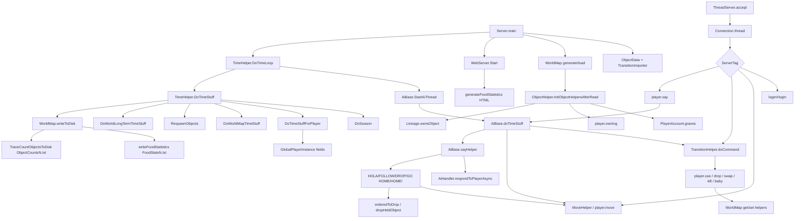

---

## 2. Haxe package dependencies

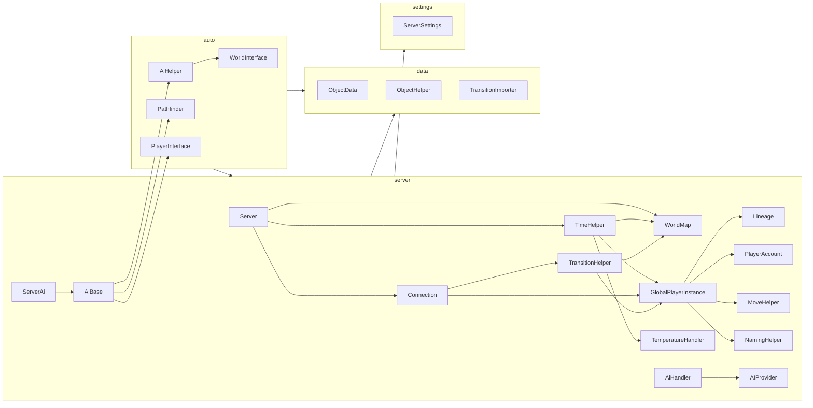

---

## 3. Rust crate dependencies

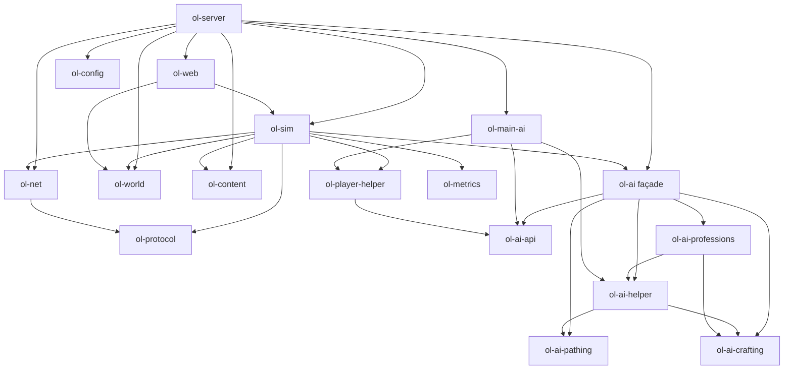

See also `docs/design/OL_AI_SPLIT.md` for AI crate roles and dedupe status.

---

## 4. Rust sim intent + tick

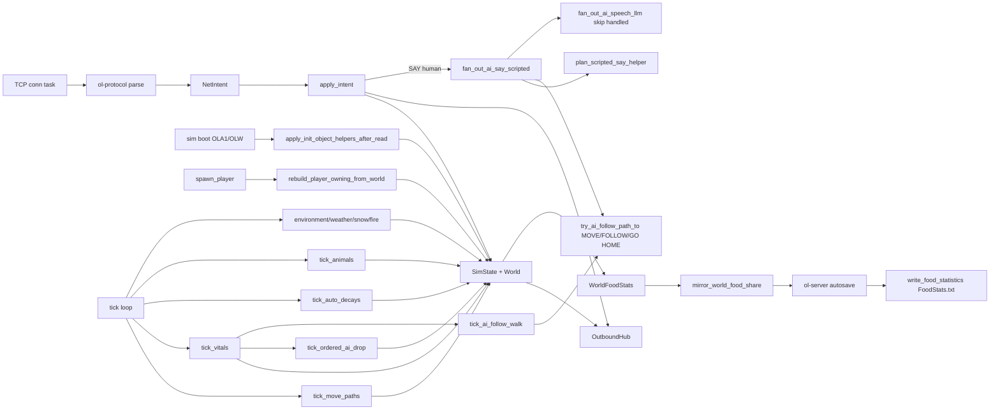

---

## 4b. FOODSTATS-DISK (FoodStats + ObjectCounts residual)

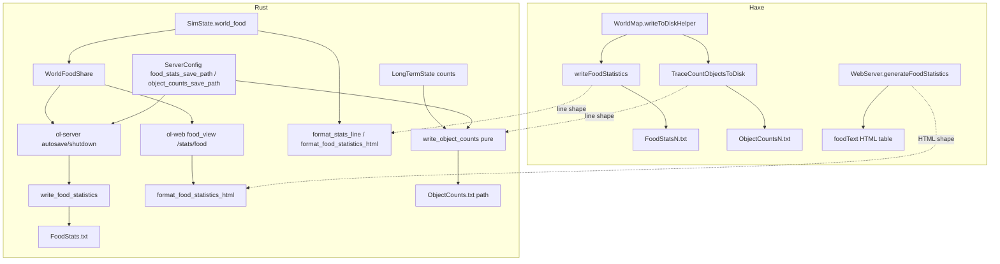

---

## 5. Haxe file → Rust crate mapping (coarse)

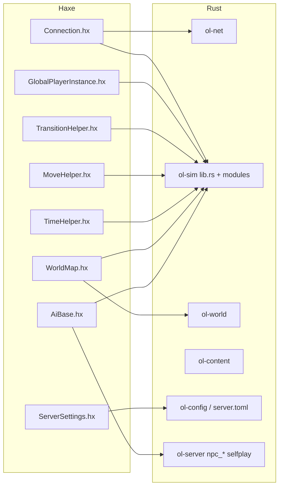

---

## 6. Transition / USE dependency (Haxe)

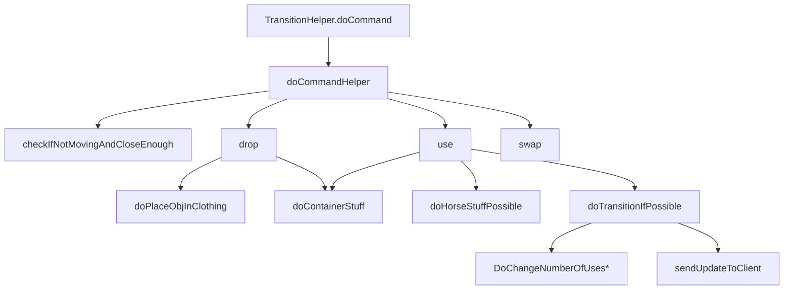

**Rust analog:** `apply_intent` → `apply_use_at` / `apply_drop` / container helpers in `lib.rs` + modules. Gaps: full multi-use edge cases, horse/vehicle, clothing nested transitions — see TODO_PORT.

---

## 7. Tick player slice dependency (Haxe)

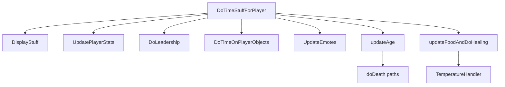

---

## 8. AI dependency (Haxe)

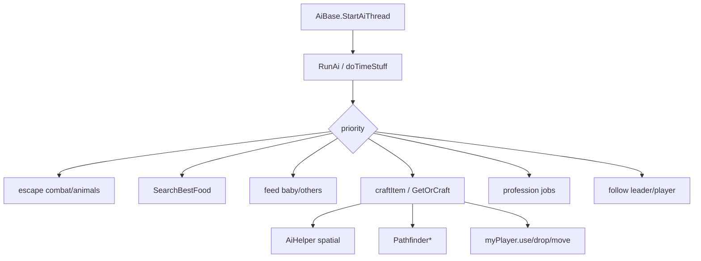

**Rust:** `ai_goals` + self-play + NPC explore — **far thinner** than AiBase.

---

## 9. Fertility + twin-code wait (`FERTILITY-TWINS`)

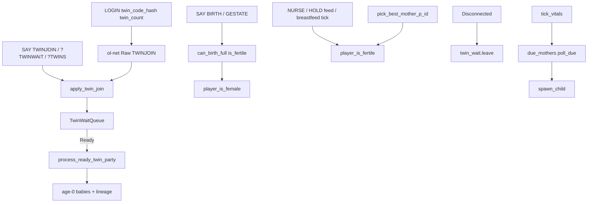

Residual: multi-server `TwinRegistry` inter-server sockets/ping/handoff (**TWIN-MULTI-SERVER** PARTIAL pure+live registry); twin death heart-link; ObjectData.male content parse.

---

## 10. Session war / posse WPS1 (`SOCIAL-WAR-PERSIST`)

Haxe had **no** server disk for WAR/POSSE (protocol `WR`/`PJ` only). Rust product session maps:

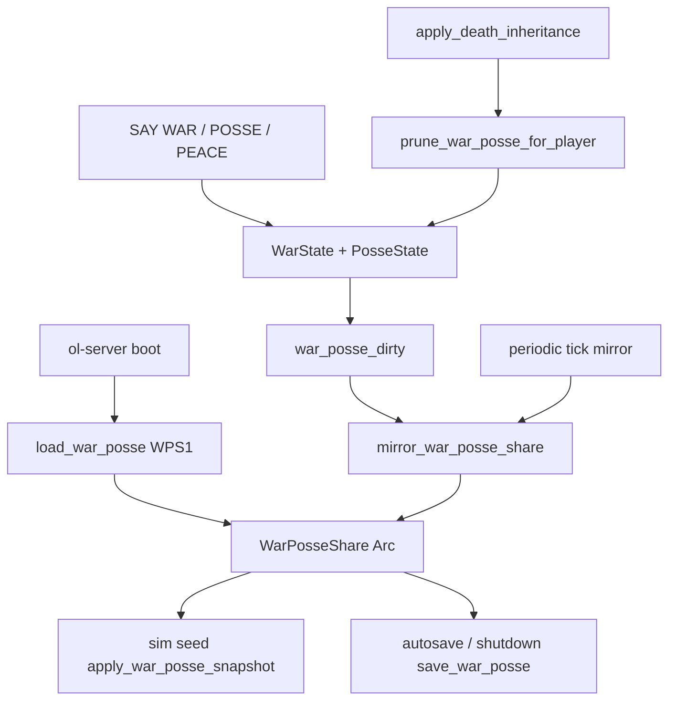

Residual: keys are session `p_id` (Players.bin sticky residual); disconnect without death keeps edges.

---

## 11. How an AI agent should use these graphs

1. Identify subsystem (net tag / tick phase / AI / persist).  
2. Open the matching graph section.  
3. Jump to **CALL_INDEX.md** for function names.  
4. Open Haxe file at function; open Rust module from **FILE_MATRIX.md**.  
5. Diff behavior; implement missing; update **TODO_PORT.md**.
